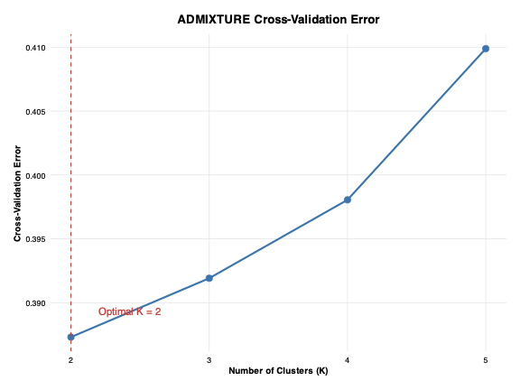
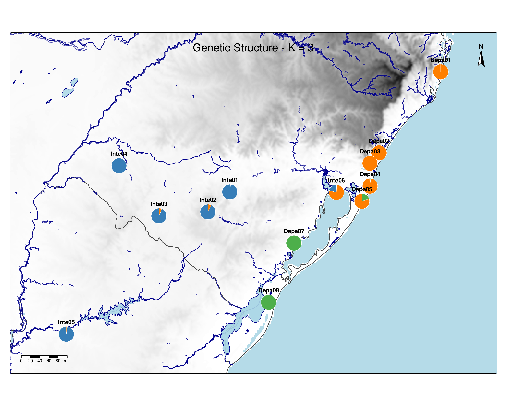
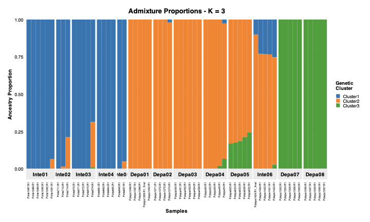

# Admixture Spatial Visualization Pipeline

[](https://opensource.org/licenses/MIT)
[](https://www.r-project.org/)
[](https://cran.r-project.org/package=admixspatial)

## Overview

This pipeline processes ADMIXTURE results and creates spatial visualizations of population structure for **any species and geographic region**. It integrates genetic admixture proportions with geographic data to produce:

- Cross-validation error plots for K selection
- Individual ancestry bar plots
- Population-level admixture maps overlaid on topography
- Geographic distribution of genetic clusters

### 🚀 **New in Latest Version (v0.1.0)**
- **Configuration File Support** - Use `--conf_file` with config.yaml to override CLI args (replaces .env)
- **Custom Bounding Box** - Define user-specific bbox via config or CLI (`--bbox`); auto fallback with configurable padding
- **Modular Architecture** - Enhanced `admixture_visualization.R` supports single Q file or batch processing
- **Dynamic K Detection** - Automatically reads K from Q file columns (filename-independent)
- **Flexible CV Plotting** - Optional cross-validation error visualization via .out files
- **No setup required** - automatically downloads spatial data
- **Works anywhere** - species and region agnostic
- **Smart caching** - faster subsequent runs
- **Selective processing** - choose specific K values
- **Enhanced water features** - combines multiple data sources

| CV Error Analysis | Spatial Genetic Structure |
|:--:|:--:|
|  |  |
| *Cross-validation error across K values* | *Spatial visualization of genetic structure (K=3)* |

| Population Admixture Structure |
|:--:|
|  |
| *Individual ancestry proportions for K=3 in Petunia populations* |

## Features

- **🌍 Species/Region Agnostic**: Works with any species and geographic region worldwide
- **🗺️ Automatic Spatial Data**: Downloads elevation, water bodies, and boundaries automatically based on sample coordinates
- **📊 Adaptive Map Extent**: Map boundaries automatically adjust to your data coordinates with configurable padding
- **💾 Smart Caching**: Spatial data is cached locally to speed up subsequent runs
- **🎨 Publication-Ready Visualizations**: Creates high-quality figures for scientific publications
- **🔄 Reproducible Workflow**: Configuration management and session tracking
- **⚡ Parallel Processing**: Efficient handling of large genomic datasets
- **🎯 Flexible K Selection**: Process all K values or specify a single K value
- **🔧 Modular Design**: Supports single Q file (`--q_file`) or batch directory (`--input_dir`) processing
- **📈 Dynamic K Detection**: Automatically detects K from Q file columns (no filename dependency)
- **📉 Optional CV Plot**: Provide `--log_dir` for .out files to generate CV error plot

## Installation

### Package Installation (Recommended)

```bash
# Install from CRAN (NOT YET available)
install.packages("admixspatial")

# Or install from GitHub
devtools::install_github("seguzmanro/admixture_pipeline_viz")
```

### Prerequisites

- R (≥ 4.0.0)
- System dependencies for spatial packages:
  ```bash
  # Ubuntu/Debian
  sudo apt-get install libudunits2-dev libgdal-dev libgeos-dev libproj-dev

  # Fedora/CentOS
  sudo dnf install udunits2-devel gdal-devel geos-devel proj-devel

  # macOS (using Homebrew)
  brew install udunits gdal geos proj
  ```

### CLI Installation (Legacy)

- Clone the repository:
  ```bash
  git clone https://github.com/seguzmanro/admixture_pipeline_viz.git
  cd admixture_pipeline_viz
  ```
- Install required R packages:
  ```bash
  Rscript -e "install.packages(c('argparse', 'yaml', 'sf', 'terra', 'tmap', 'ggplot2', 'dplyr', 'tidyr', 'future.apply', 'purrr', 'RColorBrewer', 'rnaturalearth', 'rnaturalearthdata', 'osmdata', 'elevatr', 'digest'))"
  ```
- **No additional configuration needed!** Use the provided `config/config.yaml` for example data, or create your own. The pipeline automatically downloads spatial data as needed.
## Usage

### Package Usage (Recommended)

#### Library Usage
```r
library(admixspatial)

# Quick visualization with minimal parameters
quick_visualize(
  q_file = "path/to/file.Q",
  fam_file = "path/to/file.fam",
  popmap_file = "path/to/popmap.csv",
  coords_file = "path/to/coordinates.csv",
  output_dir = "results"
)

# Advanced usage with full control
visualize_admixture(
  q_file = "path/to/file.Q",
  fam_file = "path/to/file.fam",
  popmap_file = "path/to/popmap.csv",
  coords_file = "path/to/coordinates.csv",
  output_dir = "results",
  k_value = 3,  # Process only K=3
  labels = TRUE,  # Add population labels
  dpi = 300,
  cache_dir = "/custom/cache/path"  # Optional custom cache directory
)
```

#### Batch Processing
```r
library(admixspatial)

# Process multiple Q files
q_files <- list.files("admixture_results", pattern = "\\.Q$", full.names = TRUE)

for (q_file in q_files) {
  k_value <- as.numeric(sub(".*K(\\d+)\\..*", "\\1", basename(q_file)))

  visualize_admixture(
    q_file = q_file,
    fam_file = "data.fam",
    popmap_file = "popmap.csv",
    coords_file = "coordinates.csv",
    output_dir = paste0("results_K", k_value),
    k_value = k_value,
    labels = TRUE
  )
}
```

### CLI Usage (Legacy Support)

#### Basic Execution (All K values, CV error plot)
```bash
Rscript inst/scripts/admixture_visualization.R \
  --input_dir path/to/admixture_results \
  --log_dir path/to/admixture_results \
  --fam path/to/plink.fam \
  --popmap path/to/popmap.csv \
  --coords path/to/coordinates.csv \
  --output_dir results \
  --dpi 300
```

#### Using Config File
```bash
Rscript inst/scripts/admixture_visualization.R \
  --conf_file config/config.yaml
```

### Command Line Options
|Argument|Description|Default|
|---|---|---|
|--input_dir|ADMIXTURE output directory|```$EXAMPLE_ADMIX_DIR```|
|--q_file|File with admixture proportions|```NULL```|
|--k_value|Process only this K value (optional, from the --input_dir option)|All K values|
|--log_dir|directory with .out log files from ADMIXTURE runs. Usually the same as the ADMIXTURE output directory|```NULL```|
|--fam|PLINK .fam file|```$EXAMPLE_FAM```|
|--popmap|CSV mapping samples to populations|```$EXAMPLE_POPMAP```|
|--coords|CSV with population coordinates|```$EXAMPLE_COORDS```|
|--output_dir|Output directory|```$EXAMPLE_OUTPUT_DIR```|
|--parallel_workers|Number of parallel workers|4|
|--dpi|Resolution for PNG plots (maps)|300|
|--cache_dir|Directory for caching spatial data|```NULL``` (uses package library)|

## Input Files
### Configuration File (config.yaml)
The pipeline uses `config.yaml` for defaults. Create or edit it to set paths, bbox, padding. Example in `config/config.yaml`.

Format:
```yaml
q_file: null  # or path/to/Q.file
input_dir: path/to/dir
log_dir: null
k_value: null
fam: path/to/fam
popmap: path/to/popmap.csv
coords: path/to/coords.csv
output_dir: results
parallel_workers: 4
dpi: 300
bbox: null  # or [xmin, ymin, xmax, ymax]
padding: 0.15
cache_dir: null  # or /path/to/custom/cache (null uses package library)
```

CLI args override config values.

### Q Files (Admixture Proportions):
- Single: Provide via `--q_file path/to/file.Q` or config (K detected from # columns)
- Batch: Provide directory via `--input_dir /path/to/dir` or config containing multiple `.Q` files

### Optional .out Files (CV Errors):
- Provide directory via `--log_dir /path/to/dir` or config containing `.out` files for CV error plot
- Plot generated only if multiple K values present; otherwise skipped

### PLINK .fam File:
```text
  FAM001 SAMPLE001 0 0 0 -9
  FAM002 SAMPLE002 0 0 0 -9
  ...
```
(Second column provides sample order; provide via --fam or config)

### Population Map (popmap.csv):
```csv
  indv,pop
  SAMPLE001,POP_A
  SAMPLE002,POP_B
```
(Maps samples to populations; via --popmap or config)

### Population Coordinates (coordinates.csv):
```csv
  pop,lon,lat
  POP_A,-56.123,-32.456
  POP_B,-55.987,-33.210
```
(Provides lon/lat for each population; via --coords or config)

### Custom Bounding Box:
- Via config: bbox: [xmin, ymin, xmax, ymax]
- Via CLI: --bbox 'xmin,ymin,xmax,ymax'
- Overrides auto bbox from coordinates.
## Output
The script generates outputs based on mode (CV plot only if log_dir provided):

```
results/
  ├── cv_error_plot.pdf           # CV error plot (optional)
  ├── admixture_map_K2.png        # Spatial map for K=2
  ├── admixture_map_K3.png        # Spatial map for K=3
  ├── admixture_barplot_K2.pdf    # Admixture proportions barplot for K=2
  ├── admixture_barplot_K3.pdf    # Admixture proportions barplot for K=3
  └── session_info.txt            # Reproducibility information
```

**Note**: Maps as PNG, barplots/CV as PDF. In single mode, outputs named by detected K. Custom bbox/padding applied if provided. PNG versions convertible via tools like `sips` (macOS) or ImageMagick.

## Example Dataset

### Run with included *Petunia* sample data:

**Using Config (Batch - All K):**
```bash
Rscript R/admixture_visualization.R \
  --conf_file config/config.yaml
```

**CLI Batch - All K values:**
```bash
Rscript R/admixture_visualization.R \
  --input_dir examples/Pdepint \
  --fam examples/Pdepint/Pdepint_M095_noSele.fam \
  --popmap examples/Pdepint/Pops_Pdepint.csv \
  --coords examples/Pdepint/Pdepint_Lat_Long_Coords.csv \
  --output_dir examples/Pdepint/plot_results
```

**Single Q file (detected K=3):**
```bash
Rscript R/admixture_visualization.R \
  --q_file examples/Pdepint/Pdepint_M095_noSele.3.Q \
  --fam examples/Pdepint/Pdepint_M095_noSele.fam \
  --popmap examples/Pdepint/Pops_Pdepint.csv \
  --coords examples/Pdepint/Pdepint_Lat_Long_Coords.csv \
  --output_dir examples/Pdepint/single_results
```

**Batch with CV and K=3, custom bbox:**
```bash
Rscript R/admixture_visualization.R \
  --input_dir examples/Pdepint \
  --log_dir examples/Pdepint \
  --fam examples/Pdepint/Pdepint_M095_noSele.fam \
  --popmap examples/Pdepint/Pops_Pdepint.csv \
  --coords examples/Pdepint/Pdepint_Lat_Long_Coords.csv \
  --output_dir examples/Pdepint/plot_results \
  --k_value 3 \
  --bbox '-57,-34,-55,-32'
```

**Custom padding (0.2):**
```bash
Rscript R/admixture_visualization.R \
  --conf_file config/config.yaml \
  --padding 0.2
```

## Spatial Data (Automatic)

The pipeline automatically downloads and caches spatial data based on your sample coordinates:

|Data Type|Description|Source|Cache Location|
|---|---|---|---|
|**Water Bodies**|Rivers and lakes|OpenStreetMap|`[package_lib]/admixspatial/cache_maps/osm_water/`|
|**Elevation**|Digital elevation models|SRTM (via elevatr)|`[package_lib]/admixspatial/cache_maps/`|

### Automatic Features:
- **Adaptive extent**: Map boundaries automatically fit your data coordinates
- **Smart caching**: Downloaded data is cached locally for faster subsequent runs
- **Multi-source water data**: Combines OpenStreetMap and Natural Earth water features
- **Configurable resolution**: Elevation data resolution adjustable via `elev_zoom` parameter

## Customization

### ✅ Ready to Use for Any Species/Region
The pipeline is now **fully species and region agnostic**! Simply provide your coordinates and it will:
- Automatically detect the appropriate geographic region
- Download relevant spatial data (boundaries, water, elevation)
- Adjust map extent to fit your data

### Advanced Customization Options

**Modify map appearance:**
- Adjust color palettes in `R/plot_formats.R`
- Customize elevation resolution by modifying `elev_zoom` in `load_basemap_data()`
- Change map padding by adjusting the `padding` parameter

**Extend functionality:**
- Add new visualizations in `R/plot_formats.R`
- Incorporate additional spatial layers in `R/spatial_helpers.R`
- Integrate with other genetics tools (PLINK, fastSTRUCTURE)

**Use custom spatial data:**
- Modify `config.yaml` to specify paths to your own spatial datasets
- Override automatic downloads with pre-processed local files

## Reproducibility

The pipeline ensures reproducible results through:

- **Session information**: Complete R environment details saved to `session_info.txt`
- **Package versions**: All dependencies and versions recorded
- **Execution parameters**: Command-line arguments logged
- **Cached spatial data**: Consistent spatial layers across runs
- **Deterministic downloads**: Spatial data integrity verified through caching

### Cache Management
- Spatial data cached in `cache_maps/` directory within the package library (default)
- Users can specify custom cache directory via `cache_dir` parameter or config
- Cache automatically managed - no manual cleanup needed
- Cached files speed up subsequent analyses
- Cache location is consistent regardless of working directory (when using default)

## Citation
If using this software, please cite:
```bibtex
@software{admixture_spatial_pipeline,
  author = {Sebastián Guzmán Rodríguez},
  title = {Admixture Spatial Visualization Pipeline: Species-agnostic visualization of population genetic structure},
  year = {2025},
  url = {https://github.com/seguzmanro/admixture_pipeline_viz}
}
```

# License
MIT License - see LICENSE for details

## Troubleshooting

### Common Issues

**Spatial data download fails:**
- Check internet connection
- Verify coordinates are in valid lon/lat format
- Clear cache: `rm -rf [package_lib]/admixspatial/cache_maps/` and retry

**Memory issues with large datasets:**
- Reduce elevation resolution by decreasing `elev_zoom` in `spatial_helpers.R`
- Process individual K values using `--k_value` parameter

**Maps appear empty or incorrect:**
- Verify coordinate system (should be WGS84 decimal degrees)
- Check coordinate column names match expected format (lon, lat)
- Ensure coordinates are in correct order (longitude, latitude)

### Performance Tips
- First run may be slower due to spatial data downloads
- Subsequent runs are much faster thanks to caching
- Use `--k_value` to process specific K values for faster testing
- Reduce `--dpi` for faster preview generation

## Support
For questions or issues:

1. Check the troubleshooting section above
2. Open a GitHub Issue with your coordinate range and error messages

---

<b>Developed by:</b> Sebastian Guzman

<b>Affiliation:</b> Departamento de Genetica - Universidade Federal do Rio Grande do Sul

<b>Contact:</b> sebastian.guzman@ufrgs.br