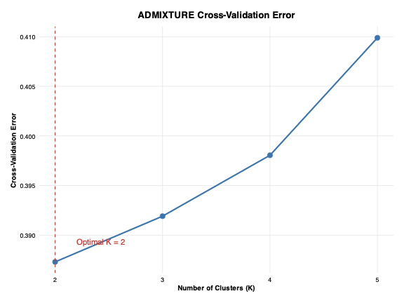
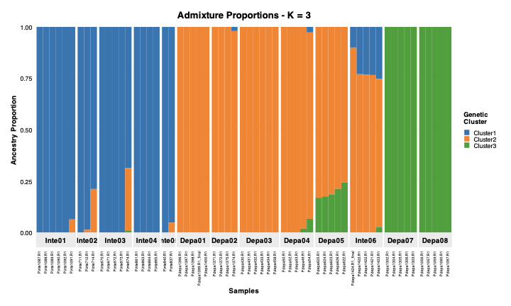

# Admixture Spatial Visualization Pipeline

[](https://opensource.org/licenses/MIT)
[](https://www.r-project.org/)

## Overview

This pipeline processes ADMIXTURE results and creates spatial visualizations of population structure for **any species and geographic region**. It integrates genetic admixture proportions with geographic data to produce:

- Cross-validation error plots for K selection
- Individual ancestry bar plots
- Population-level admixture maps overlaid on topography
- Geographic distribution of genetic clusters

### 🚀 **New in Latest Version**
- **No setup required** - automatically downloads spatial data
- **Works anywhere** - species and region agnostic
- **Smart caching** - faster subsequent runs
- **Selective processing** - choose specific K values
- **Enhanced water features** - combines multiple data sources

| CV Error Analysis | Spatial Genetic Structure |
|:--:|:--:|
|  |  |
| *Cross-validation error across K values* | *Spatial visualization of genetic structure (K=3)* |

| Population Admixture Structure |
|:--:|
|  |
| *Individual ancestry proportions for K=3 in Petunia populations* |

## Features

- **🌍 Species/Region Agnostic**: Works with any species and geographic region worldwide
- **🗺️ Automatic Spatial Data**: Downloads elevation, water bodies, and boundaries automatically based on sample coordinates
- **📊 Adaptive Map Extent**: Map boundaries automatically adjust to your data coordinates with configurable padding
- **💾 Smart Caching**: Spatial data is cached locally to speed up subsequent runs
- **🎨 Publication-Ready Visualizations**: Creates high-quality figures for scientific publications
- **🔄 Reproducible Workflow**: Configuration management and session tracking
- **⚡ Parallel Processing**: Efficient handling of large genomic datasets
- **🎯 Flexible K Selection**: Process all K values or specify a single K value

## Installation

### Prerequisites

- R (≥ 4.0.0)
- System dependencies for spatial packages:
  ```bash
  # Ubuntu/Debian
  sudo apt-get install libudunits2-dev libgdal-dev libgeos-dev libproj-dev
  
  # Fedora/CentOS
  sudo dnf install udunits2-devel gdal-devel geos-devel proj-devel
  ```
### Setup
- Clone the repository:
  ```bash
  git clone https://github.com/yourusername/petunia-admixture.git
  cd petunia-admixture
  ```
- Install required R packages:  
  ```bash
  Rscript -e "install.packages(c('argparse', 'dotenv', 'sf', 'terra', 'tmap', 'ggplot2', 'dplyr', 'tidyr', 'future.apply', 'purrr', 'RColorBrewer', 'rnaturalearth', 'rnaturalearthdata', 'osmdata', 'elevatr', 'digest'))"
  ```
- Configure environment (optional - only needed if using custom spatial data):
  ```bash
  # Copy and customize environment file
  cp .env .env.local
  nano .env.local  # Update with your custom spatial data paths if needed
  ```
- **No additional configuration needed!** The pipeline automatically downloads spatial data as needed.
## Usage

### Basic Execution (All K values)
```bash
cd R/
Rscript admixture_visualization.R \
  --input_dir path/to/admixture_results \
  --fam path/to/plink.fam \
  --popmap path/to/popmap.csv \
  --coords path/to/coordinates.csv \
  --output_dir results \
  --dpi 300
```

### Process Specific K Value Only
```bash
cd R/
Rscript admixture_visualization.R \
  --input_dir path/to/admixture_results \
  --fam path/to/plink.fam \
  --popmap path/to/popmap.csv \
  --coords path/to/coordinates.csv \
  --output_dir results \
  --k_value 3 \
  --dpi 300
```
### Command Line Options
|Argument|Description|Default|
|---|---|---|
|--input_dir|ADMIXTURE output directory|```$EXAMPLE_ADMIX_DIR```|
|--fam|PLINK .fam file|```$EXAMPLE_FAM```|
|--popmap|CSV mapping samples to populations|```$EXAMPLE_POPMAP```|
|--coords|CSV with population coordinates|```$EXAMPLE_COORDS```|
|--output_dir|Output directory|```$EXAMPLE_OUTPUT_DIR```|
|--k_value|Process only this K value (optional)|All K values|
|--parallel_workers|Number of parallel workers|4|
|--dpi|Resolution for PNG plots (maps)|300|

## Input Files
### ADMIXTURE Output Directory:
  ```.Q``` files (admixture proportions)

  ```.out``` files (log files with CV errors)
### PLINK .fam File:
```text
  FAM001 SAMPLE001 0 0 0 -9
  FAM002 SAMPLE002 0 0 0 -9
  ...
```
### Population Map (popmap.csv):
```csv
  indv,pop
  SAMPLE001,POP_A
  SAMPLE002,POP_B
```
### Population Coordinates (coordinates.csv):
```csv
  pop,lon,lat
  POP_A,-56.123,-32.456
  POP_B,-55.987,-33.210
```
## Output
The pipeline generates these outputs in the specified directory:
```
results/
  ├── cv_error_plot.pdf           # CV error plot with optimal K
  ├── admixture_map_K2.png        # Spatial map for K=2
  ├── admixture_map_K3.png        # Spatial map for K=3
  ├── admixture_barplot_K2.pdf    # Admixture proportions barplot for K=2
  ├── admixture_barplot_K3.pdf    # Admixture proportions barplot for K=3
  └── session_info.txt            # Reproducibility information
```

**Note**: Maps are generated as PNG files (suitable for presentations/web), while barplots and CV error plots are generated as PDF files (vector format for publications). PNG versions of barplots and CV plots can be easily generated using tools like `sips` (macOS) or ImageMagick for documentation purposes.

## Example Dataset

### Run with included *Petunia* sample data:

**Process all K values:**
```bash
cd R/
Rscript admixture_visualization.R \
  --input_dir ../examples/Pdepint \
  --fam ../examples/Pdepint/Pdepint_M095_noSele.fam \
  --popmap ../examples/Pdepint/Pops_Pdepint.csv \
  --coords ../examples/Pdepint/Pdepint_Lat_Long_Coords.csv \
  --output_dir ../examples/Pdepint/plot_results
```

**Process only K=3:**
```bash
cd R/
Rscript admixture_visualization.R \
  --input_dir ../examples/Pdepint \
  --fam ../examples/Pdepint/Pdepint_M095_noSele.fam \
  --popmap ../examples/Pdepint/Pops_Pdepint.csv \
  --coords ../examples/Pdepint/Pdepint_Lat_Long_Coords.csv \
  --output_dir ../examples/Pdepint/plot_results \
  --k_value 3
```

## Spatial Data (Automatic)

The pipeline automatically downloads and caches spatial data based on your sample coordinates:

|Data Type|Description|Source|Cache Location|
|---|---|---|---|
|**Water Bodies**|Rivers and lakes|OpenStreetMap|`cache_maps/osm_water/`|
|**Elevation**|Digital elevation models|SRTM (via elevatr)|`cache_maps/`|

### Automatic Features:
- **Adaptive extent**: Map boundaries automatically fit your data coordinates
- **Smart caching**: Downloaded data is cached locally for faster subsequent runs
- **Multi-source water data**: Combines OpenStreetMap and Natural Earth water features
- **Configurable resolution**: Elevation data resolution adjustable via `elev_zoom` parameter

## Customization

### ✅ Ready to Use for Any Species/Region
The pipeline is now **fully species and region agnostic**! Simply provide your coordinates and it will:
- Automatically detect the appropriate geographic region
- Download relevant spatial data (boundaries, water, elevation)
- Adjust map extent to fit your data

### Advanced Customization Options

**Modify map appearance:**
- Adjust color palettes in `R/plot_formats.R`
- Customize elevation resolution by modifying `elev_zoom` in `load_basemap_data()`
- Change map padding by adjusting the `padding` parameter

**Extend functionality:**
- Add new visualizations in `R/plot_formats.R`
- Incorporate additional spatial layers in `R/spatial_helpers.R`
- Integrate with other genetics tools (PLINK, fastSTRUCTURE)

**Use custom spatial data:**
- Modify the `.env` file to specify paths to your own spatial datasets
- Override automatic downloads with pre-processed local files

## Reproducibility

The pipeline ensures reproducible results through:

- **Session information**: Complete R environment details saved to `session_info.txt`
- **Package versions**: All dependencies and versions recorded
- **Execution parameters**: Command-line arguments logged
- **Cached spatial data**: Consistent spatial layers across runs
- **Deterministic downloads**: Spatial data integrity verified through caching

### Cache Management
- Spatial data cached in `cache_maps/` directory
- Cache automatically managed - no manual cleanup needed
- Cached files speed up subsequent analyses

## Citation
If using this software, please cite:
```bibtex
@software{admixture_spatial_pipeline,
  author = {Sebastián Guzmán Rodríguez},
  title = {Admixture Spatial Visualization Pipeline: Species-agnostic visualization of population genetic structure},
  year = {2025},
  url = {https://github.com/seguzmanro/admixture-spatial-pipeline}
}
```

# License
MIT License - see LICENSE for details

## Troubleshooting

### Common Issues

**Spatial data download fails:**
- Check internet connection
- Verify coordinates are in valid lon/lat format
- Clear cache: `rm -rf cache_maps/` and retry

**Memory issues with large datasets:**
- Reduce elevation resolution by decreasing `elev_zoom` in `spatial_helpers.R`
- Process individual K values using `--k_value` parameter

**Maps appear empty or incorrect:**
- Verify coordinate system (should be WGS84 decimal degrees)
- Check coordinate column names match expected format (lon, lat)
- Ensure coordinates are in correct order (longitude, latitude)

### Performance Tips
- First run may be slower due to spatial data downloads
- Subsequent runs are much faster thanks to caching
- Use `--k_value` to process specific K values for faster testing
- Reduce `--dpi` for faster preview generation

## Support
For questions or issues:

1. Check the troubleshooting section above
2. Open a GitHub Issue with your coordinate range and error messages

---

<b>Developed by:</b> Sebastian Guzman

<b>Affiliation:</b> Departamento de Genetica - Universidade Federal do Rio Grande do Sul

<b>Contact:</b> sebastian.guzman@ufrgs.br